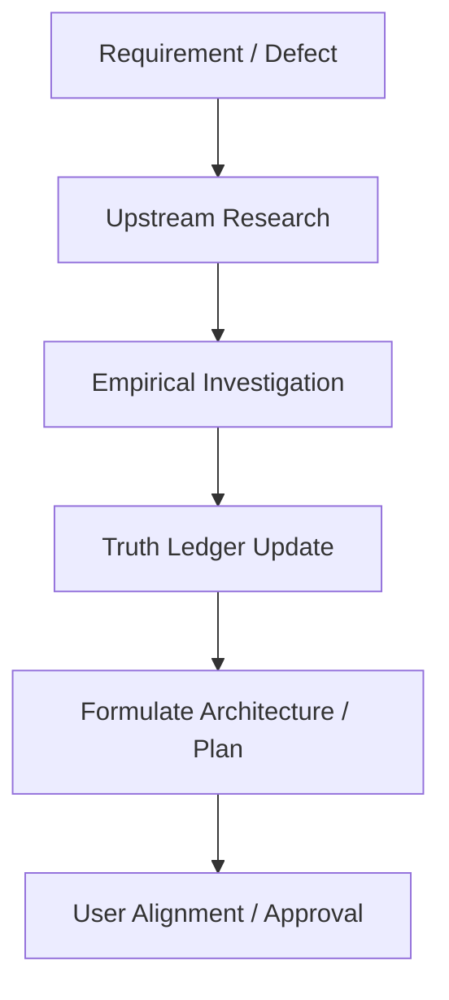

# WORKFLOW: RESEARCH FIRST

1. Query authoritative sources before coding.
2. Log findings into `docs/EVIDENCE_LOG.md`.
3. Update `docs/TRUTH_LEDGER.md` with baseline state.
4. Structure the proposal and obtain approval before editing application logic.
