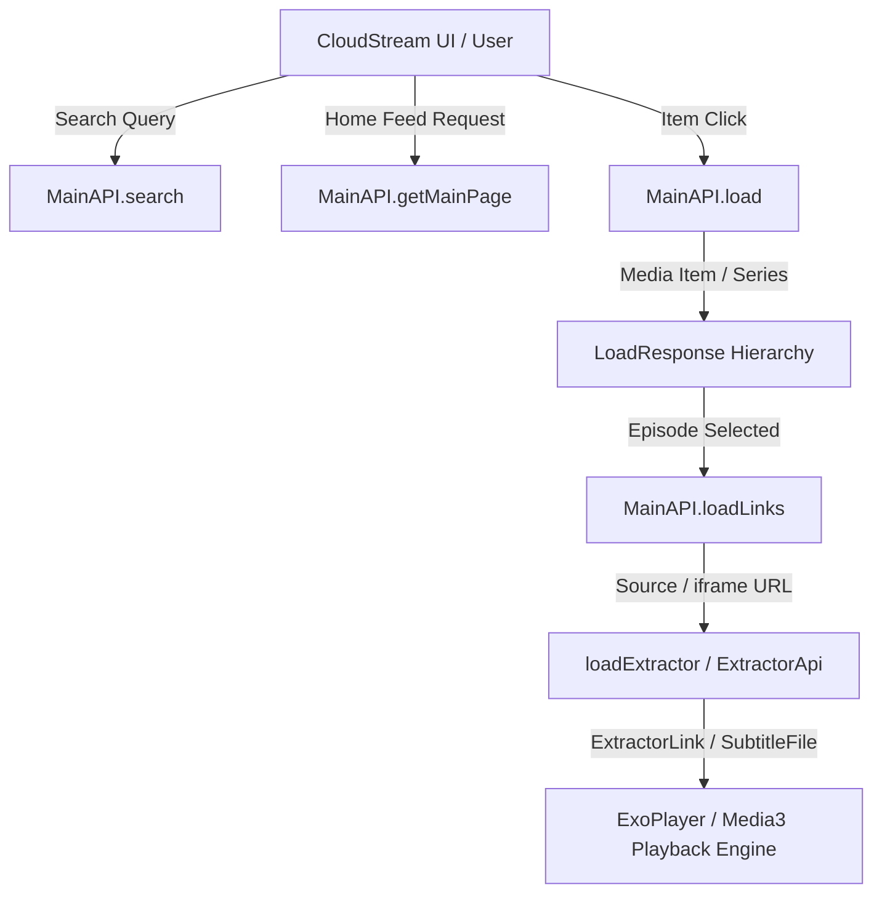

# AETHELIONCS: CLOUDSTREAM EXTENSION ARCHITECTURE RESEARCH

============================================================
1. ARCHITECTURAL OVERVIEW & LIFECYCLE
============================================================

CloudStream 3 extensions are dynamic Android libraries packaged into `.cs3` files containing DEX bytecode and metadata. The runtime executes provider modules via a standardized lifecycle:



### Lifecycle Phases:
1. **SEARCH (`MainAPI.search(query)`):**
   - Input: Search query string.
   - Output: `List<SearchResponse>` (e.g. `TvSeriesSearchResponse`, `MovieSearchResponse`, `AnimeSearchResponse`).
   - Responsibility: Fetch site search results, parse thumbnails, titles, and media URLs.

2. **HOME (`MainAPI.getMainPage(page, request)`):**
   - Input: `page: Int`, `request: MainPageRequest` (contains category name and URL data).
   - Output: `HomePageResponse` wrapping `List<HomePageList>`.
   - Responsibility: Provide categorized rows of media items for the application home screen.

3. **DETAIL & LOAD (`MainAPI.load(url)`):**
   - Input: Canonical series or movie URL.
   - Output: `LoadResponse` (`TvSeriesLoadResponse` or `MovieLoadResponse`).
   - Responsibility: Parse synopsis, year, genres, actors, rating, posters, trailers, and the complete episode tree.

4. **EPISODE DATA MAPPING:**
   - Every episode in a series is modeled as an `Episode` object:
     `newEpisode(data = episodeUrl) { name = "..."; season = S; episode = E; posterUrl = "..."; rating = ... }`
   - Critical: The `data` property is the immutable identity token passed directly to `loadLinks`.

5. **LOAD LINKS (`MainAPI.loadLinks(data, isCasting, subtitleCallback, callback)`):**
   - Input: `data` string (episode URL or serialized source payload).
   - Execution: Resolves player embeds, iframes, and video hosts.
   - Output: Streams resolved links via `callback: (ExtractorLink) -> Unit` and external subtitles via `subtitleCallback: (SubtitleFile) -> Unit`.

6. **EXTRACTOR DELEGATION (`loadExtractor`):**
   - Uses native CloudStream extractors (`com.lagradost.cloudstream3.utils.loadExtractor`) to resolve upstream video hosts (e.g. VidMoly, Rapidrame, StreamTape, FileLions, etc.).

7. **PLAYBACK:**
   - CloudStream ExoPlayer consumes the `ExtractorLink` (Direct MP4, HLS/M3U8, DASH) with specified headers (User-Agent, Referer) and plays video.

============================================================
2. COMPONENT INTERFACES & RESPONSIBILITIES
============================================================

### 1. Plugin Entrypoint: `BasePlugin`
Each provider module must declare a plugin entrypoint annotated with `@CloudstreamPlugin`:
```kotlin
package com.aethelion

import com.lagradost.cloudstream3.plugins.BasePlugin
import com.lagradost.cloudstream3.plugins.CloudstreamPlugin

@CloudstreamPlugin
class DiziBoxPlugin : BasePlugin() {
    override fun load() {
        registerMainAPI(DiziBoxProvider())
        // Optional: registerExtractorAPI(CustomExtractor())
    }
}
```

### 2. Main API Base Class: `MainAPI`
Defines provider metadata and hooks:
- `override var name: String` — Human-readable provider name.
- `override var mainUrl: String` — Primary base domain.
- `override val hasMainPage: Boolean` — Enables home screen categories.
- `override var lang: String` — ISO 639-1 language code (e.g. `"tr"`).
- `override val supportedTypes: Set<TvType>` — Supported types (e.g. `setOf(TvType.TvSeries, TvType.Movie)`).
- `override val mainPage: List<MainPageData>` — Category definitions for home feed.

============================================================
3. ERROR CONTAINMENT & FAULT ISOLATION
============================================================

1. **Independent Module Isolation:**
   Each provider lives in its own Gradle subproject. A failure or syntax breakage in one provider does not compile-break or runtime-break other providers.
2. **Safe API Calls:**
   Use `safeApiCall { ... }` around dynamic network calls to prevent unhandled runtime exceptions from crashing the parent application.
3. **No Empty Catch Blocks:**
   All exceptions caught during network transport or DOM parsing must log diagnostic details (class, message, and target URL).
