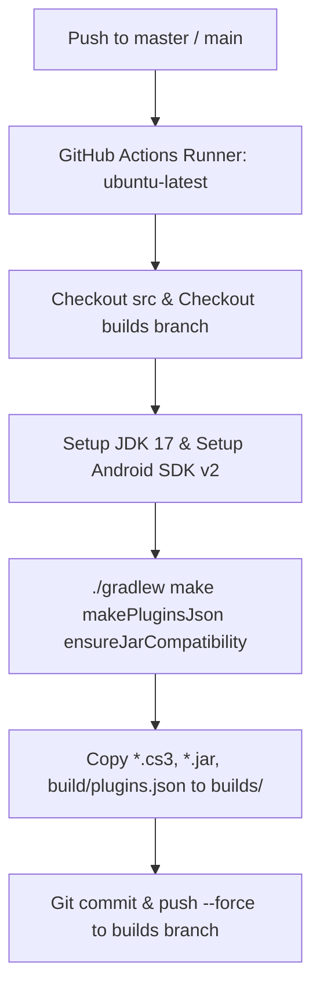

# AETHELIONCS: BUILD SYSTEM & CI/CD DEEP SPECIFICATION

============================================================
1. BUILD TOOLCHAIN STACK
============================================================

Based on direct inspection of `recloudstream/extensions` and `recloudstream/TestPlugins`:

### Observed Versions:
- **Gradle Version:** `8.10` / `8.11` (Gradle Wrapper)
- **Android Gradle Plugin (AGP):** `com.android.tools.build:gradle:8.7.3`
- **Kotlin Gradle Plugin:** `org.jetbrains.kotlin:kotlin-gradle-plugin:2.3.0`
- **CloudStream Plugin:** `com.github.recloudstream:gradle:-SNAPSHOT`
- **CloudStream Library:** `com.github.recloudstream.cloudstream:library:-SNAPSHOT`
- **NiceHttp:** `com.github.Blatzar:NiceHttp:0.4.11`
- **Jsoup:** `org.jsoup:jsoup:1.18.3`
- **Jackson:** `com.fasterxml.jackson.module:jackson-module-kotlin:2.13.1` (Strict limit)
- **Compile / Target SDK:** `35`
- **Min SDK:** `21`
- **JVM Target:** `JavaVersion.VERSION_1_8` / `JvmTarget.JVM_1_8`

============================================================
2. CI/CD WORKFLOW DESIGN
============================================================

### Key Workflow Characteristics:
1. **Concurrency Control:** `concurrency: { group: "build", cancel-in-progress: true }` prevents duplicate builds race condition.
2. **Dual-Checkout:** Checks out `src` (source code) and `builds` (orphan deployment branch) into separate directories.
3. **Artifact Cleanup:** Cleans old `*.cs3` and `*.jar` in `builds` directory before copying fresh builds.
4. **Compatibility Verification:** Runs `./gradlew ensureJarCompatibility` to ensure bytecode consistency.
5. **Permissions:** Requires `contents: write` permission for GitHub token to push to the `builds` branch.
