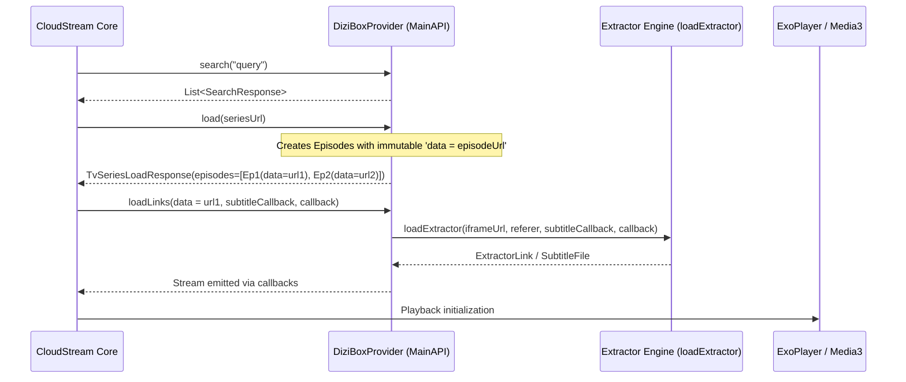

# AETHELIONCS: OFFICIAL CLOUDSTREAM PROVIDER DEEP RESEARCH

============================================================
1. OFFICIAL PROVIDER ARCHITECTURAL ANALYSIS
============================================================

Based on deep inspection of official repositories (`recloudstream/extensions` and `recloudstream/TestPlugins`):

### Analyzed Official Providers:
1. **`YoutubeProvider`** (`recloudstream/extensions/master/YoutubeProvider/src/main/kotlin/recloudstream/YoutubeProvider.kt`)
   - **Type:** Media / Playlist / Channel streaming.
   - **Load Lifecycle:** Preserves episode identity via URL mapping (`newEpisode(item.url)`).
   - **LoadLinks Lifecycle:** Directly delegates `loadLinks(data = itemUrl)` to `loadExtractor("https://youtube.com/watch?v=$data", subtitleCallback, callback)`.
   - **Fault Isolation:** Page parsing uses pagination thresholds to avoid API overhead.

2. **`TwitchProvider`** (`recloudstream/extensions/master/TwitchProvider/src/main/kotlin/recloudstream/TwitchProvider.kt`)
   - **Type:** Live stream parsing.
   - **Load Lifecycle:** Parses live metadata and channel rank.
   - **Extractor Integration:** Embeds an inner `TwitchExtractor : ExtractorApi()` defining custom JSON API stream resolution (`pwn.sh/tools/streamapi.py`) and emitting `newExtractorLink` with quality parameters (`quality = getQualityFromName(...)`).

3. **`InvidiousProvider`** (`recloudstream/extensions/master/InvidiousProvider/src/main/kotlin/recloudstream/InvidiousProvider.kt`)
   - **Type:** Multi-instance video and playlist scraping.
   - **LoadLinks Lifecycle:** Resolves HLS manifests and direct MP4 qualities, feeding `callback` directly.

============================================================
2. CORE LIFECYCLE & EPISODE IDENTITY INVARIANTS
============================================================

### Invariant Rules:
1. **Stateless `loadLinks`:** `loadLinks` must treat `data` as the sole authority for resolution.
2. **Zero Shared State:** No class-level instance properties (`var currentVideoUrl`) or global variables may hold transient episode data.
3. **Failure Isolation:** Each server / iframe in `loadLinks` must be wrapped in `safeApiCall { ... }` or `try/catch` so that a broken iframe on Server A does not halt resolution of Server B or Server C.
