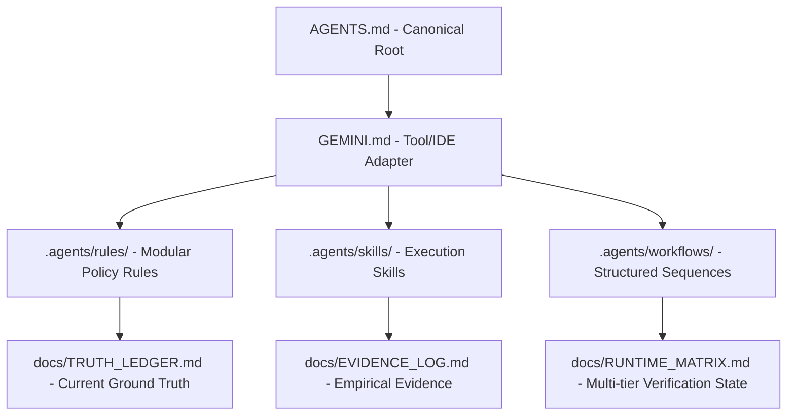

# AGENT ARCHITECTURE & COMPONENT ROLES

## Component Definitions
- `AGENTS.md`: Highest-precedence canonical operating system definition.
- `GEMINI.md`: Antigravity environment adapter mapping user tasks to rules.
- `.agents/rules/`: Enforceable boundaries (Truth, Testing, Research, Git, Security).
- `.agents/skills/`: On-demand specialized procedures (Forensics, Verification, Release).
- `.agents/workflows/`: Phase-by-phase execution guides.
- `docs/TRUTH_LEDGER.md`: Persistent state ledger tracking verified vs unverified items.
- `docs/EVIDENCE_LOG.md`: Raw execution evidence supporting ledger updates.
- `docs/RUNTIME_MATRIX.md`: Comprehensive tier-by-tier test matrix.
