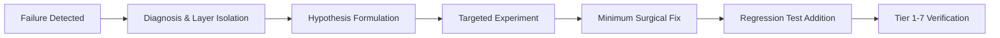

# FAILURE PROTOCOL

## Mandatory Rules on Failure
1. Acknowledge user observations immediately as valid `USER_OBSERVATION` data points.
2. Mark previous conflicting claims as `CONFLICTING_EVIDENCE`.
3. Do not attempt random fixes; follow the 11-step forensic debug process.
4. Add an automated regression test covering the failure condition before declaring resolution.
